# LovelyFrida 使用说明

> 按完整业务流程逐步骤操作，覆盖全部功能。以 2026 盘古石杯第二轮 APK-1（notevault 密码还原）为示例贯穿。

---

## 〇、准备

### 环境要求
- Node ≥ 20、Rust stable (MSVC)、Python 3.11+ 且 `pip install frida`
- MuMu 12（或其他 x86_64 Android 模拟器）
- frida-server 已放入 `bin\frida-server\<版本>\android-<abi>\`

### 启动
```bash
npm install
npm run dev:tauri
```
> 端口自动探测（规避 WinNAT 保留段漂移），启动后自动弹出 LovelyFrida 窗口。

---

## 一、流水线：环境体检

**位置：左侧导航 ①**

点击「快速体检」（<2s，本地项 + adb 现状）或「深度体检（连接重试）」（每端口 15s 硬超时 + offline 自愈 ×5）。

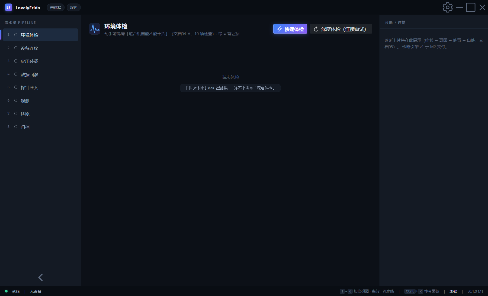

10 项检查逐条展开可看证据原文、修复建议与**等价命令**（可复制进终端手工跑——工具教你原理，不是替你跳过原理）。

> **绿 = 有证据**：状态灯由探测结果点亮，不是由命令返回码点亮。

---

## 二、设备连接（会话管理）

**位置：左侧导航 ②**

### adb 连接
输入 IP:端口 →「连接」（15s 硬超时）或「自愈重连」（disconnect→2s→connect ×5）。

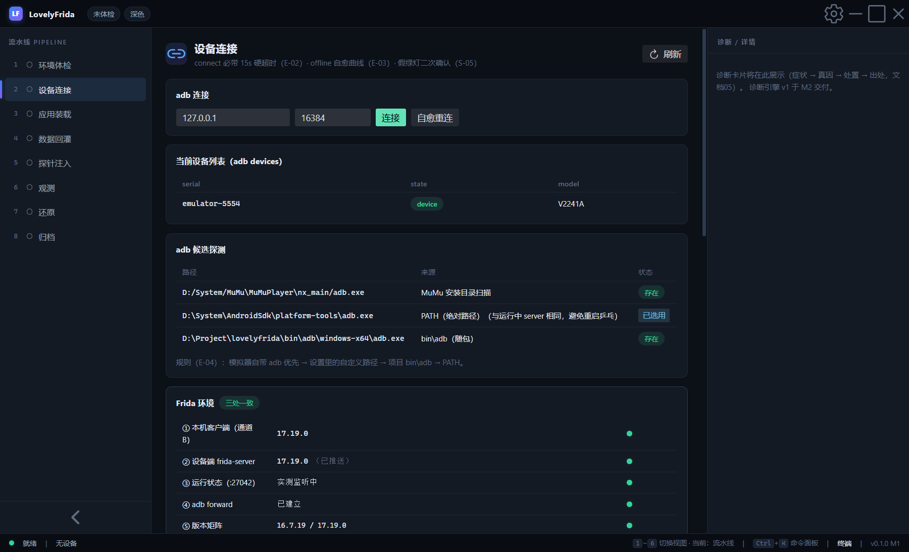

### frida-server 托管
点击「安装并启动」——自动：清残留 → 推送匹配版本（与客户端一致，S-01）→ chmod → 启动 → `ss -tlnp` 实测监听。七步逐步报告。

### 进程附加
「枚举进程」→ 系统/用户分组列表 → 在目标行点「附加」。

> **注入成功判据**：状态步进器走到「运行中」+ hello 证据（frida 版本/pid/Java 版本）。

---

## 三、数据回灌

**位置：左侧导航 ④**

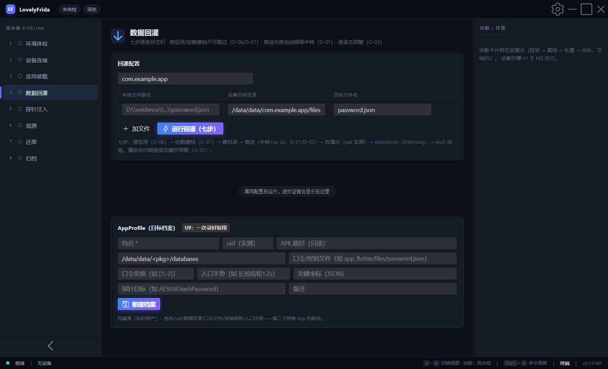

填入包名 + 文件行（本地路径 → 设备目录 → 文件名），点「运行回灌」。七步：停应用(D-06) → 空跑建档(D-07) → 建目录 → 推送（中转 + su cp）→ 改属主（uid 实测）→ restorecon → **md5 逐文件校验**。

灌完自动扫描 shared_prefs 里的**登录态键**并预警（O-03：灌了密码 App 直接进主页，探针就零命中了）。

### AppProfile（U9）
下方档案编辑器：包名/uid/数据目录/口令文件/变换规则/入口手势一次录好，点「带入回灌」自动填充——第二个同类 App 的起点。

---

## 四、探针注入

**位置：左侧导航 ⑤**

### 探针工作台
填类名 + 方法名 →「挂探针」→ 命中实时进时间轴。**重载全展开、byte[] hex 化、超长截断、可逆卸载**——零行 JS。

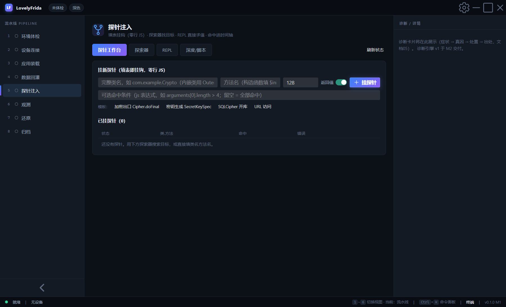

> 构造函数填 `$init`。可选条件过滤（js 表达式）。快捷模板：加密出口 / 密钥生成 / SQLCipher 开库 / URL。

### 探索器
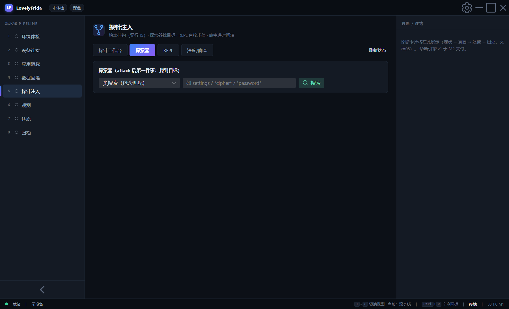

类搜索（包含匹配）→ 查看方法 → **挂探针**一键带入表单。方法搜索支持 `*类!*方法*` 通配。attach 后第一件事：在这里找目标。

### 深度观测 + 脚本库
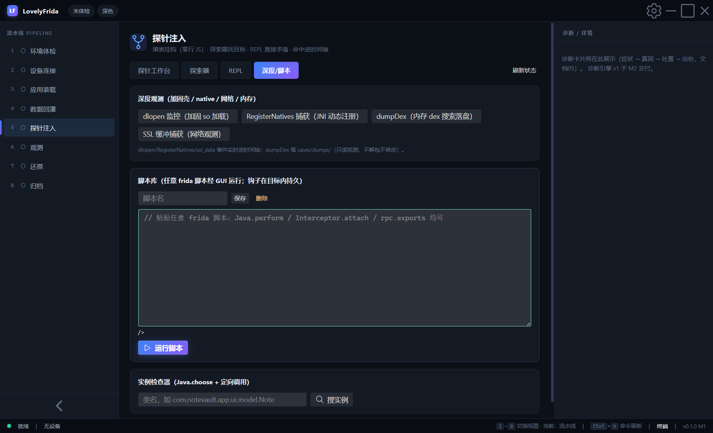

四个按钮：**dlopen 监控**（加固 so 加载）、**RegisterNatives 捕获**（JNI 动态注册）、**dumpDex**（内存 dex 搜索落盘，cases/dumps/）、**SSL 缓冲捕获**（网络数据实时进时间轴）。

脚本库：粘贴任意 frida 脚本 → 运行 → 钩子在目标内持久（console 输出进时间轴）。支持保存/加载/删除。

### 实例检查器
类名 → 搜实例 → 按 hashCode 列表 → 选中 → 输入方法名 → **在指定实例上调用方法**。

---

## 五、时间轴

**视图：底部状态栏按 `2` 或 ⌘K 面板**

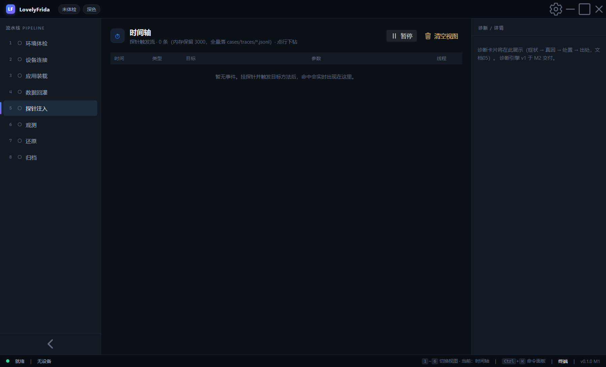

探针命中实时流入：时间 / 类型 / 目标 / 参数摘要 / 线程。**点行下钻**看完整参数（byte[] hex 展开、返回值、原始 payload）。暂停/继续/清空。全量落 `cases/traces/run-*.jsonl`。

---

## 六、差分（受控实验）

**视图：底部按 `3`**

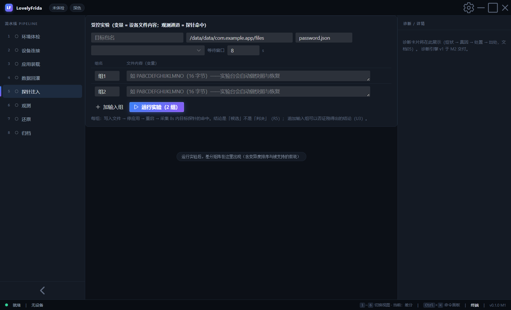

变量 = 设备文件内容；观测通道 = 探针命中。每组输入：写文件 → 停应用 → spawn → 装探针 → resume → 采集。矩阵自动计算**变异度**并排序，结论标注为「候选」（不是判决）——追加输入组可否证。

---

## 七、还原

**位置：左侧导航 ⑦**

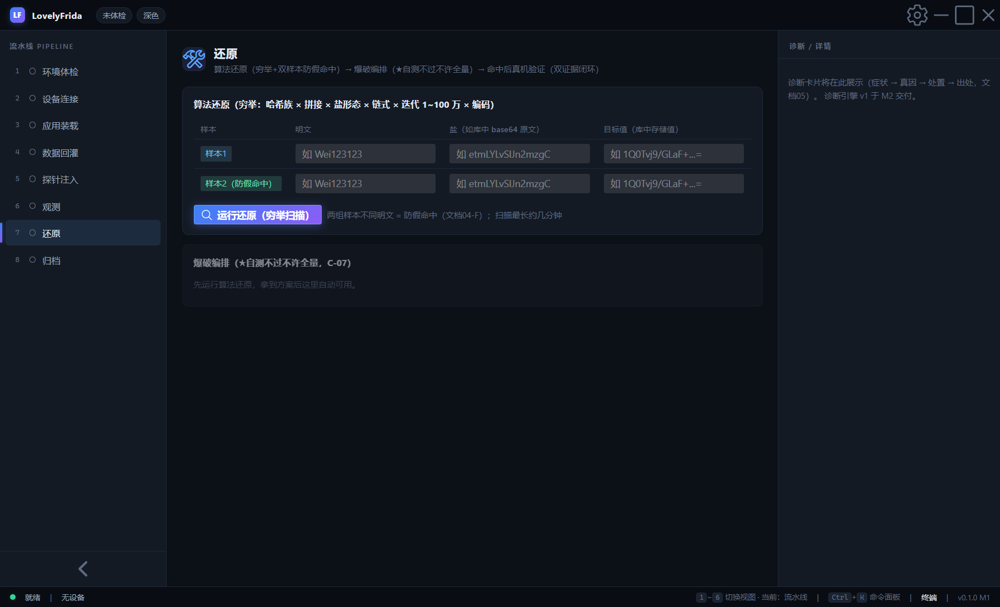

### 算法还原
两组样本（明文/盐/目标值）→ 运行穷举：SHA-256/SHA-1/MD5 × 拼接 × 盐形态 × 链式 × 迭代 1~100 万 × 编码。**双样本防假命中**：第二组不通过同一方案即排除。输出：方案描述 + Python 验证骨架 + hashcat 模式判定。

### 爆破编排
预估三件套（总数/速率/ETA）→ 引擎自动选择：内置（小空间）/ hashcat 命令（-m 1410）/ C 骨架生成（链式轮优化）。**★自测不过不许全量跑**（C-07）。命中后记得真机验证（双证据闭环）。

---

## 八、归档（Evidence 台账）

**位置：左侧导航 ⑧**

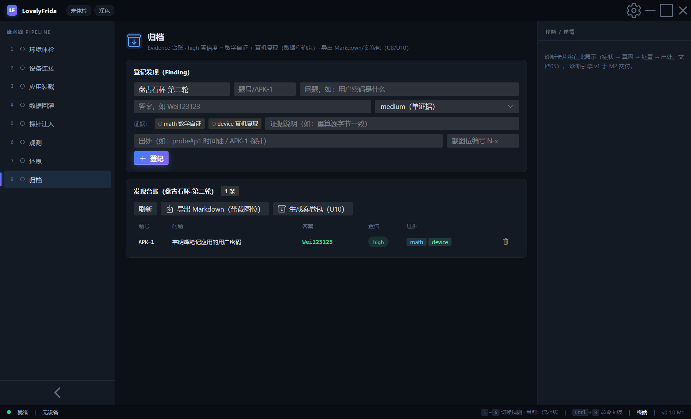

登记发现：题号/问题/答案/置信度/证据/出处/截图位。**high 置信度强制要求 math（数学自证）+ device（真机复现）双证据**——缺一条数据库直接拒绝（原则 5 代码化）。

导出：
- **Markdown**（Obsidian 友好，带【截图位 N-x】编号）
- **案卷包**（U10）：findings.md + traces/ + experiments/ + jobs/ 归拢到一个目录，接手者按包内命令复现

---

## 九、原始终端

**视图：底部按 `5` 或状态栏「终端」按钮**

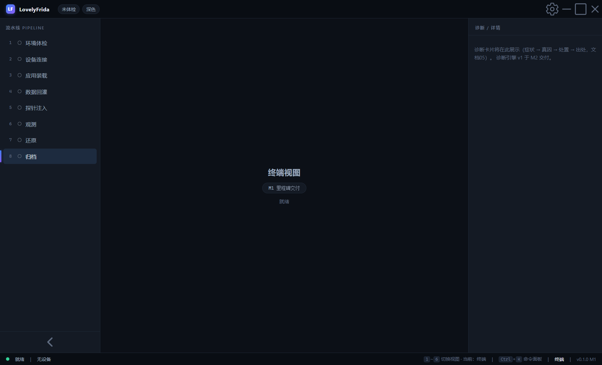

PTY 直连 adb shell，可手工执行命令兜底。Recorder 自动记录全部可视化操作为 Step（含等价命令），可导出 .ps1/.sh/.md/.json 重放。

---

## 十、键盘快捷键

| 键 | 功能 |
|---|---|
| `Ctrl+K` | 命令面板 |
| `1`~`6` | 切换六视图 |
| `Esc` | 关闭面板 |

---

## 十一、真实案例：APK-1 完整流程

1. **体检** → 快速体检全绿
2. **连接** → 枚举 → 附加 com.notevault.app（hello 握手成功）
3. **回灌** → 检材 notevault_prefs.xml 七步全绿（md5 与检材一致）
4. **定位** → 探索器搜 `*AESUtil*!*hashPassword*` → 一键挂探针
5. **触发** → 登录页输入任意密码 → 时间轴捕获 `IN='明文‖盐'` → **Base64(SHA-256(明文‖盐))** 算法定死
6. **还原** → 输入明文/盐/目标 → 穷举命中 → hashcat -m 1410 命令生成 → 爆破命中 `Wei123123`
7. **真机复现** → 登录页输入 Wei123123 → 登录通过 → 探针 ret 与 prefs 存储哈希一致
8. **归档** → 登记 high 双证据 → 案卷包导出
